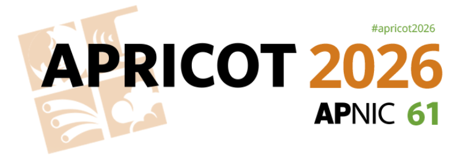
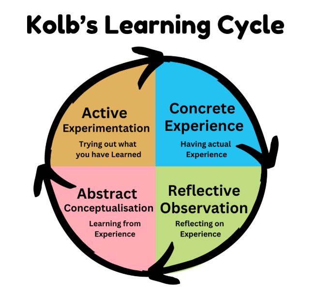
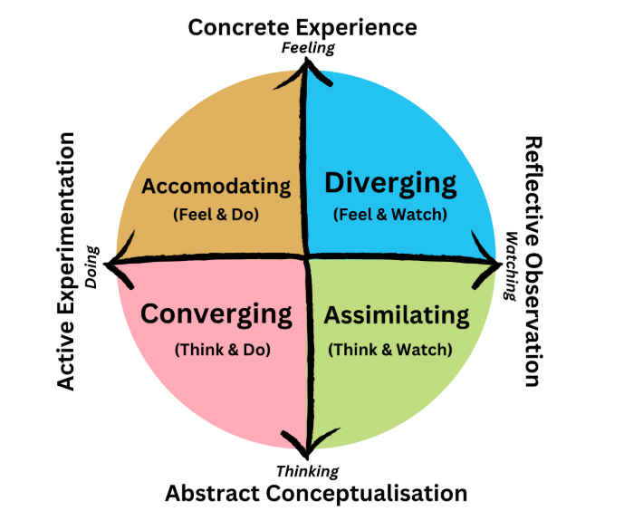
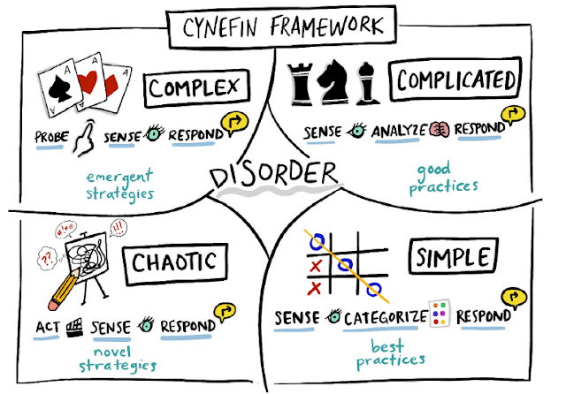
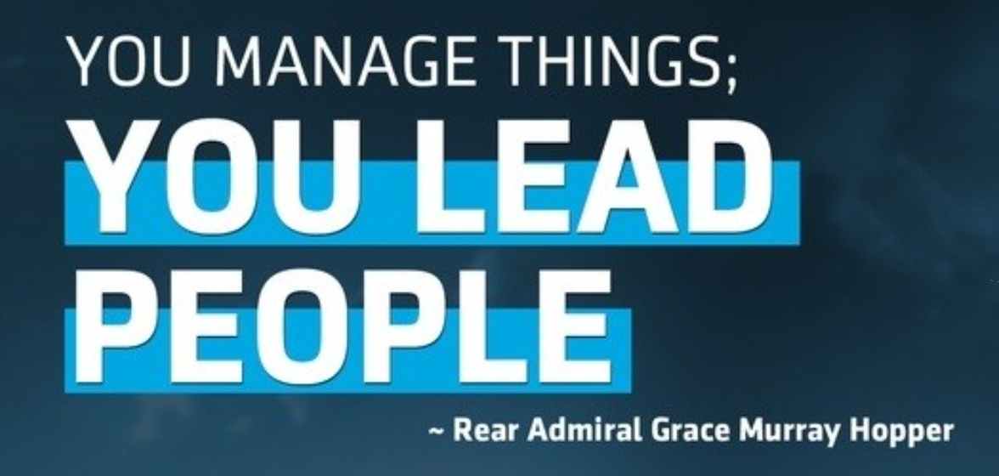

<!-- _class: title-slide -->

# From Network Engineer to Strategic Leader

 

**Terry Sweetser**
Principal Consultant
The Internet Engineering & Infrastructure Strategic Initiative
contact@ieisi.org
APRICOT 2026 - Jakarta

---

# Experiential Learning Theory

Reference:

[David Kolb’s Learning Styles and Experiential Learning Cycle](https://www.earlyyears.tv/david-kolb-learning-styles-cycle/)

---

# Terry's 3Rs Framework

1. Reliability: the quality of management factor.
2. Relevance: knowing what matters to you, your team and the business.
3. Reject: preserving a productive and constructive culture.

[From Network Engineering to CTO: What You Need to Construct to Get There](https://medium.com/@terrysweetser_90287/from-network-engineering-to-cto-what-you-need-to-construct-to-get-there-c435b7b0a889)

---

# The Thesis: The Right Mindset

Don't abandon your engineering mindset -- amplify it.

An organization is just a complex, distributed system.

Leadership is not magic; it is **Systems Architecture**.

### The Engineering Analogy
-   **Strategy** = Network Topology Design **OR** Strategy as code: IF THEN ELSE
-   **Operations** = Traffic Engineering, QoS, Break-Fix, Solving Problems
-   **Culture** = Security Protocols, Firewalls, TRUST + INTEGRITY + CARE

> **Reflective Prompt:**
> "If your team was a network, where is the packet loss occurring right now?"

---

# Reliability: The Foundation (The 3Rs)

Trust is the physical infrastructure. Without it, the link is down. Reliability is defined by the Mayer Model: **Ability** (Competence), **Integrity** (Consistency), and **Benevolence** (Care).

### Analogy: The Leadership SLA
-   **Integrity:** When a router advertises a route but drops the packet.
-   **Benevolence:** Does the system care about the health of the nodes?
-   **Result:** Low Trust = High Latency (people double-check everything you say).

> **Reflective Prompt:**
> "What is the **uptime** of your word? Do you meet the SLA you implicitly promised your team?"

---

# Relevance: Routing the Traffic (The 3Rs)

Effort must flow toward business value. The "Balanced Scorecard" approach ensures everyone knows the destination.

### Analogy: Routing Tables & BGP
-   A network without a routing protocol is just noise.
-   A team without clear goals creates "broadcast storms" of busy work.
-   You are the **BGP Peer**: You must advertise the correct prefixes (Goals) so your team routes their energy efficiently.

> **Reflective Prompt:**
> "If I asked your newest hire *'Why is your current task important to the business?'*, could they answer?"

---

# Reject: The Cultural Firewall (The 3Rs)

The "Cultural Immune System." You must actively reject toxic behaviors (information hoarding, blame, silos) to maintain system integrity.

### Analogy: Default Deny / ACLs
-   You cannot allow malicious traffic (toxicity) to traverse your network just because the source is a "High Performer" (High Bandwidth).
-   **Action:** You must courageously "drop" packets that threaten system stability.

> **Reflective Prompt:**
> "What toxic behavior (packet) are you currently allowing through your firewall because it’s coming from a 'high bandwidth' source?"

---

# Decision Architecture: Distributed Processing

Scalability requires delegation. If every decision goes to the CTO, the CPU spikes to 100% and the system halts.

### Analogy: Edge Computing
-   **Edge Nodes (Team):** Handle local traffic (Standard Decisions).
-   **Core Router (You):** Handle exceptions and complex routing.
-   **Cynefin:** Use Simple/Complicated routing for the edge; keep Complex/Chaotic routing for the core.

> **Reflective Prompt:**
> "What decision are you currently holding in the **Core** that could be processed at the **Edge**?"

---

---

# The Coaching Cascade: Org Topology

Value creation shifts as you move up the stack.

Do not commit a **Layer Violation** by doing work below your protocol level.

-   **L1: Individual Contributors** (Data Plane)
    -   *Function:* They process the packets (Do the work).
-   **L2: Managers** (Control Plane)
    -   *Function:* They organize and coach the doers (Optimize flow).
-   **L3: Executives** (Management Plane)
    -   *Function:* They coach the managers (Node health).
-   **L4: Senior Executives** (Architecture)
    -   *Function:* Teach mental models & frameworks (System Design).

> **Reflective Prompt:**
> "Are you operating at the correct layer, or are you performing **Deep Packet Inspection** on your team's work?"

---

<!-- _class: lead -->
<!-- _backgroundColor: #e88d14 -->
<!-- _color: #fff -->

# Incident Management

### Debugging Human Systems

---

# IM 1: Mode Switching (Peace vs. War)

Every well-designed system needs failover protocols. **Peace Time** is for consensus. **War Time** is for command.

### Analogy: OSPF Convergence
-   **Normal Ops:** Optimize for the lowest cost path (Efficiency/Consensus).
-   **Link Failure:** Priority shifts to **Convergence Speed**.
-   We suspend "optimization" until stability is restored.

> **Reflective Prompt:**
> "Does your team have a clear signal for when 'Democracy' is suspended and 'Command Mode' is activated? How long does that **convergence** take?"

---

# IM 2: The Root Bridge Election (Roles)

**Authority ≠ Expertise.** In a crisis, the person with the most domain knowledge regarding the *specific failure* is the Incident Commander.

### Analogy: Root Bridge Election
-   The network automatically elects the best path to the root.
-   **The Rule:** If you are paralyzed in analysis, you are not the IC. Hand it over.
-   **Exec Role:** You are the **Backup Link**. Provide "Air Cover" (Board/PR) so the Root Bridge (Expert) can route traffic.

> **Reflective Prompt:**
> "Can you put your ego aside to admit *'I am not the right person to fix this,'* and instead serve as the **firewall** protecting the person who is?"

---

# IM 3: Debugging the Human System (RCA)

You cannot patch a bug you cannot see. If your culture punishes people for causing outages, they will hide the logs.

### Analogy: Syslog & SNMP
-   Imagine if your router deleted its own error logs because it was afraid you would yell at it.
-   A culture of blame is `logging level none`.
-   You need `logging level debug` enabled by **Psychological Safety**.

> **Reflective Prompt:**
> "When a junior engineer breaks production, is their first instinct to hide the evidence or broadcast the error? What does that tell you about your **Culture**?"

---

<!-- _class: title-slide -->

# Conclusion: The Integrated System

The transition from Engineer to CTO is the transition from **doing** to **designing**.

**Reliability:** Build the physical layer (Trust).
**Relevance:** Configure the protocols (Strategy).
**Reject:** Secure the perimeter (Culture).
**Architecture:** Distribute the load (Delegation).

## Stop trying to be the Super-Router.

## Start being the Systems Architect.

